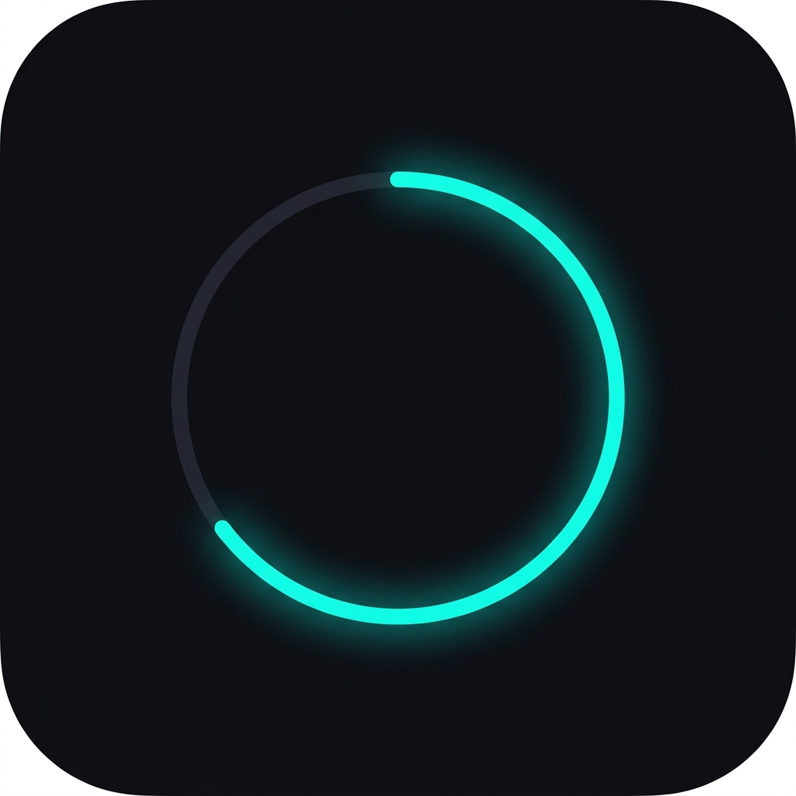
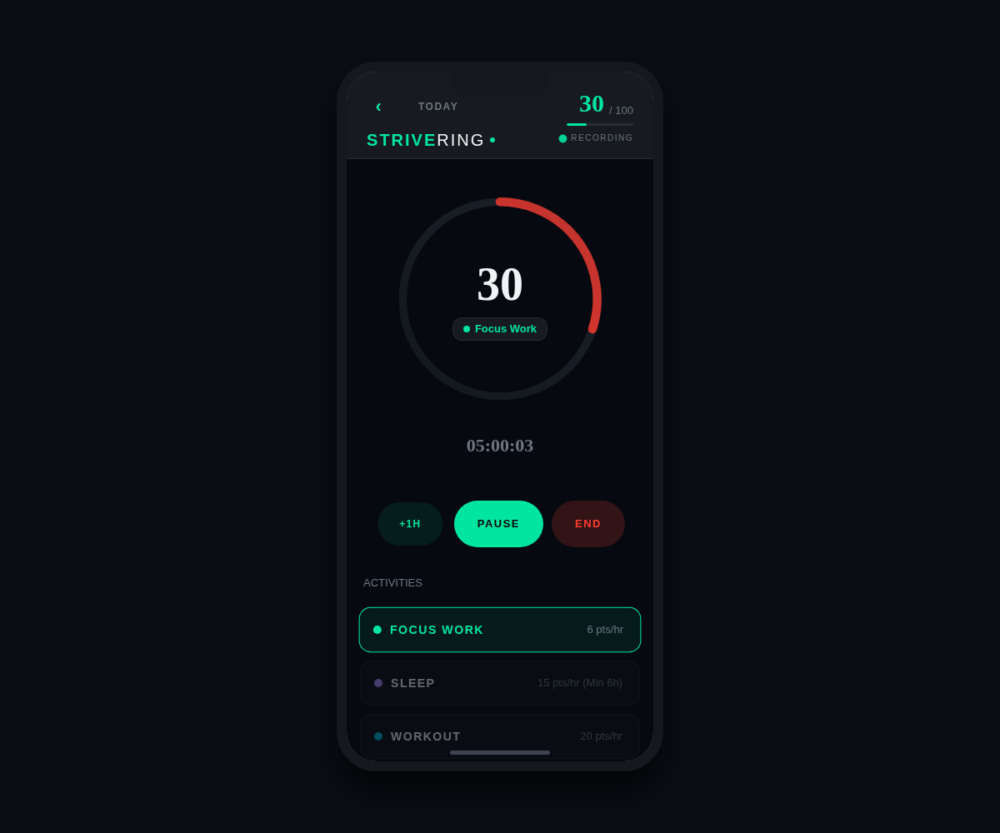
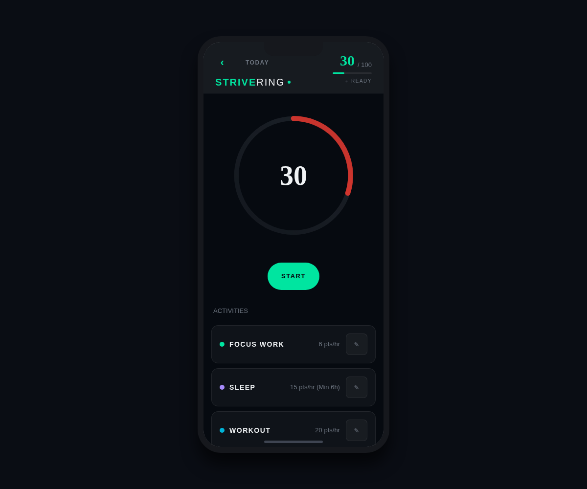
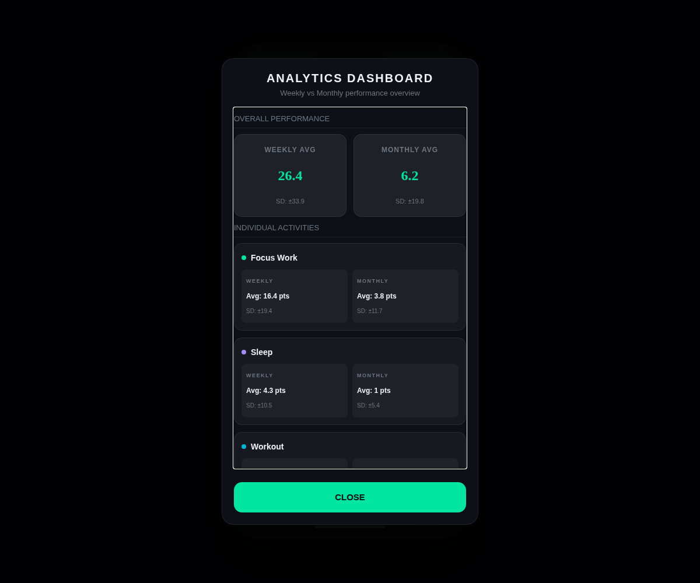
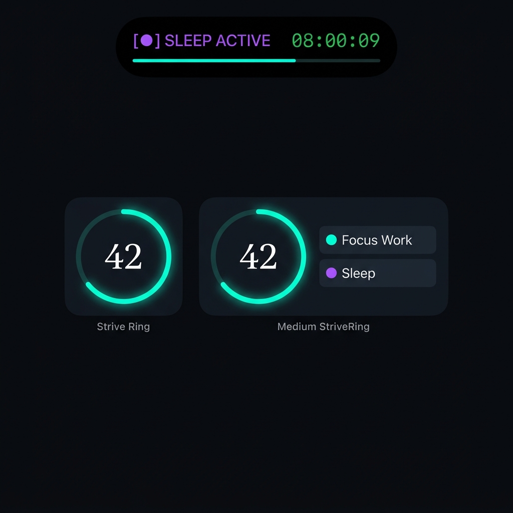

# StriveRing ⚡️
### Premium Cybernetic Wellness & Habit Tracker for iOS

[](https://developer.apple.com/xcode/)
[](https://developer.apple.com/design/human-interface-guidelines/live-activities)
[](https://expo.dev)

A modern, ultra-premium wellness tracker designed for athletes and high-performers. StriveRing features a gorgeous glassmorphic interface, a responsive score-tracking biometric ring, native SwiftUI Home Screen Widgets, and Dynamic Island Live Activities that keep your real-time timers and performance metrics accessible at a glance.

---

## 📸 Interface & Testing Highlights

### Native App Experience
<p align="center">
  
  
  
</p>

### Home Screen Widgets & Dynamic Island
<p align="center">
  
</p>

---

## ✨ Features

- 🌀 **Responsive Biometric Ring**: Markerless biometric ring that beautifully transitions from glowing Crimson ➔ Amber ➔ Neon Teal as you accumulate daily strain score.
- 🎛️ **Premium Control Dock**: Glassmorphic, frosted-glass control overlay featuring haptic response triggers to play, pause, or simulated-fast-forward (`+1 hr`) background stopwatch sessions.
- 📱 **SwiftUI Home Screen Widgets**: Small & Medium widgets reflecting overall daily strain score and active target percentages using high-performance user default container syncing.
- 🏝️ **Dynamic Island & Live Activities**: Monospaced system timer updating seamlessly within the lock screen and Dynamic Island (Compact & Expanded layouts) via standard Apple iOS ActivityKit.
- 📊 **Wellness Analytics & Historical View**: Minimalist weekly calendar with read-only swipe navigation to inspect past completed strains.
- 🔒 **Privacy-First Storage**: Secure local-first persistence driven by optimized AsyncStorage middleware.

---

## 🏛️ System Architecture

StriveRing is built using a modern **hybrid prebuild architecture** that allows React Native's state engine to communicate with iOS's native SwiftUI targets without maintaining bloated Xcode folders in the main repository:

```
┌─────────────────────────────────┐
│     React Native State Engine   │
└────────────────┬────────────────┘
                 │
                 ▼
┌─────────────────────────────────┐     Native Module
│   Shared App Group Defaults     │ ───────────────┐
└────────────────┬────────────────┘                │
                 │                                 ▼
                 ▼                        ┌─────────────────────────────────┐
┌─────────────────────────────────┐       │   ActivityKit SwiftUI Bridge    │
│     SwiftUI Home Screen Widget  │       └────────────────┬────────────────┘
└─────────────────────────────────┘                        │
                                                           ▼
                                          ┌─────────────────────────────────┐
                                          │   Dynamic Island Live Activity  │
                                          └─────────────────────────────────┘
```

---

## 🚀 100% Free PC-Free Sideloading (No Developer Account Needed)

We have bypassed Apple's $99/year developer fee by combining a **free GitHub Actions CI/CD workflow** (which builds an unsigned `.ipa` for physical devices) with **SideStore** (which signs and refreshes the app entirely on your phone via a local VPN loopback, meaning you never need a computer after setup!).

### Quick Setup Blueprint:
1. **Trigger the GitHub Build**: Go to your repository's **Actions** tab, select **Build Unsigned iOS IPA**, and click **Run workflow**. Download your compiled `StriveRing.ipa` when finished.
2. **Install SideStore**: Run the pre-configured [iLoader AppImage](file:///home/kedarnath-reddy-vallaboina/.gemini/antigravity-ide/scratch/sideload-setup/iloader-linux-amd64.AppImage) GUI on your Linux desktop once to sideload SideStore onto your connected iPhone.
3. **Sideload StriveRing**: Download the `.ipa` onto your phone and import it into SideStore wirelessly over WireGuard.

For the exact, comprehensive step-by-step tutorial, open the **[Linux SideStore Sideloading Guide](sidestore_linux_sideloading_guide.md)** inside this repository!

---

## 💻 Local Development

### 1. Install dependencies
```bash
npm install
```

### 2. Start development server
```bash
npx expo start
```

### 3. Generate native iOS project folders
```bash
npx expo prebuild --platform ios
```
